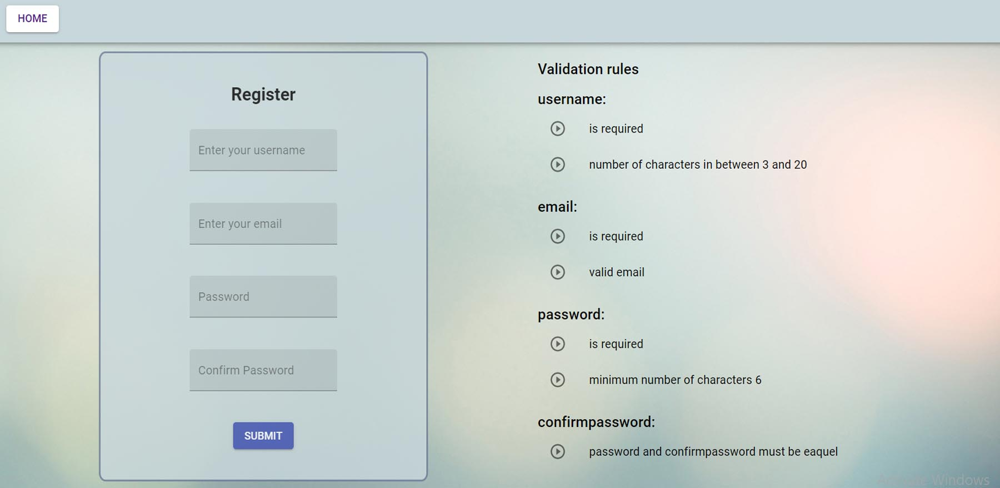
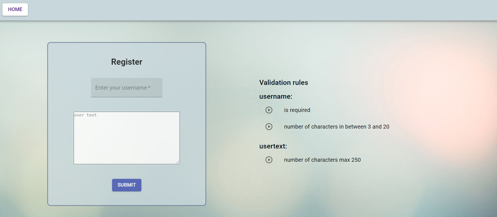

# React - form - validation
Form validation in react - reusable custom hooks for management fields value, reusable 
functions for easier validation management and errors handling - custom validator.


This project was bootstrapped with webpack, react, material ui, sass.

### Installation

1. Clone the repo
```
git clone https://github.com/janix374/React-Form-Validation.git
```
2. Install NPM packages
```
npm install
```
3. Start project 
```
npm start
```






 